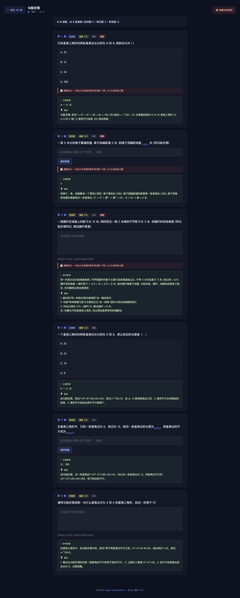
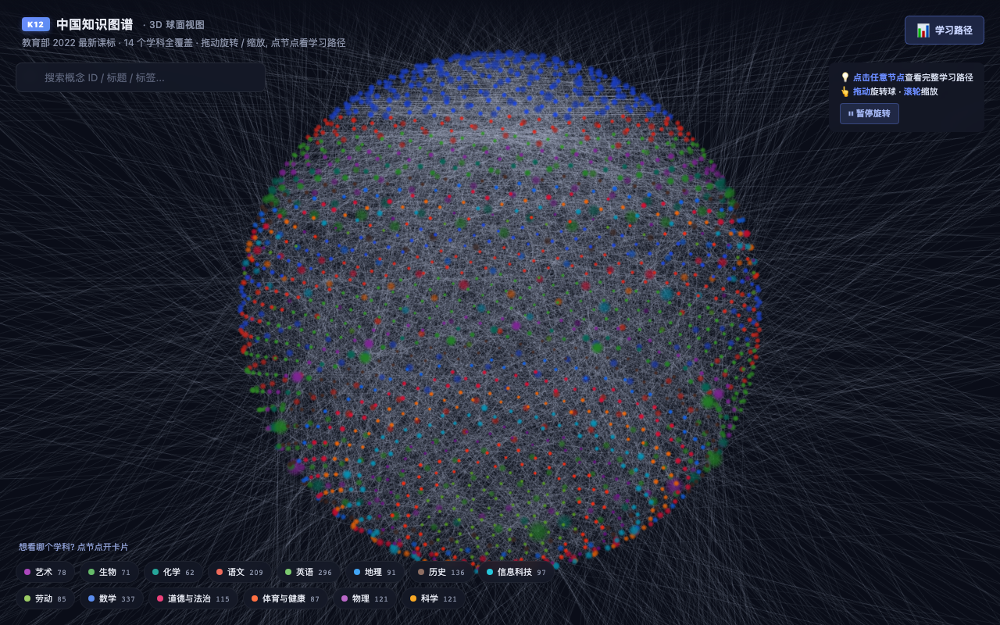
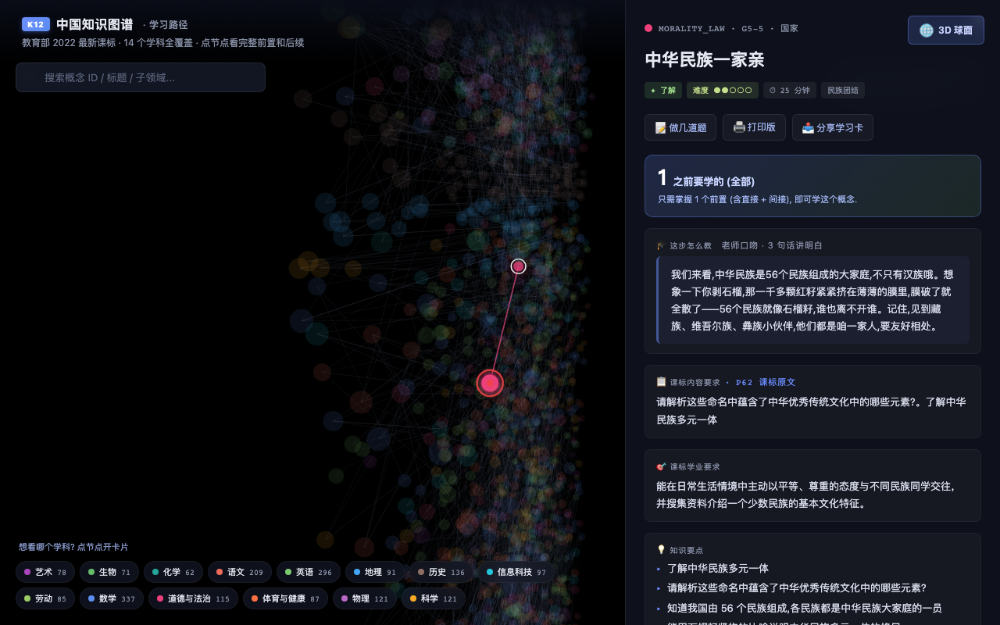

# V4.0.1 Release Notes

> **题目库升级 · 真题试点 · 题目练习页**

## 🎯 一句话总结

**9,259 道题目，14 学科 1,906 概念 100% 覆盖，5 道题/概念互补设计，每题都带 Bloom 认知层级。**

公网 demo: https://zachsaws.github.io/open-curriculum-cn/exercise.html?id=M_G4_GM_08



## 📊 数据规模

| 指标 | V4.0.0 | **V4.0.1** |
|---|---:|---:|
| 总题目数 | 5,137 | **9,259** |
| 覆盖概念 | 1,712/1,906 (89.8%) | **1,906/1,906 (100%)** |
| 学科 | 13/14 | **14/14** |
| `bloom` 字段 | 0% | **100%** |
| `is_real_exam` 标记 | 0 | **8** |
| 手动入库 | 0 | **6 概念** (1 敏感词 + 5 LLM 失败) |

## 🎯 核心变化

### 1. 题目库从 3 道题/概念升级到 5 道题/概念（互补设计）

5 道题写死进 prompt，保证 5 道题**互补不重复**：

- **T1 选择题** — 基础概念辨析，4 个选项**考察 4 个不同维度**（不是同概念 4 变体）
- **T2 填空题** — 关键步骤/关键词记忆
- **T3 简答题** — 解释/描述
- **T4 应用题** — 真实情境，**真题风格**，参考中考/小升初真题常见考法
- **T5 综合题** — 跨本概念 + 前置/后置概念，**真题压轴**

每道题带：
- **Bloom 认知层级** 标签（理解 / 记忆 / 分析 / 应用 / 评价）
- **难度 1-5** 标签
- 完整答案 + 解析 + 评分要点（T4/T5 简答含分步评分标准）

**抽样验证** (5 学科各 1 概念)：
- **math** (M_G2_NS_22 估算): T1 选项 2/3/1/4 排 4 维度；T4 春游大巴估算；T5 综合判断带钱够不够
- **chinese** (CN_C1_AL_07 音序检字): T1 不同查字维度；T4 妹妹问生字；T5 综合 2 字排序+评价
- **english** (EN_G12_LS_02 动作记单词): T1 抄写/动作/翻译/发呆 4 维度；T4 设计游戏规则；T5 对比 2 种方法
- **science** (SC_S3_MS_05 简单机械): T1 4 维度；T4 搬水+木板斜面；T5 3 种机械对比哪种最省力
- **history** (H_H4_WB_03 工业革命): T1 4 维度；T4 材料题 2 问；T5 3 段论述（变化+影响+辩证）

### 2. 真实题试点（math 3 核心考点）

math 3 个中考核心考点手动入库 8 道**经典常考题**：

| 概念 | 数量 | 题型 |
|---|---:|---|
| M_G4_GM_08 勾股定理 | 3 | 6-8-10 直角三角形 + 梯子靠墙 + 旗杆影子比例 |
| M_G4_QR_05 一元二次方程 | 3 | x²=16 双根 + 因式分解 + 连续两次降价 |
| M_G4_QR_11 二次函数 | 2 | 抛物线顶点 + 拱桥最高点 |

UI 标"📋 真题"标签 + 红色高亮。

> **注**：中国中考真题版权分散，公开带答案的完整题库难找。这些是"经典常考题型"而非具体某省某年的真题。后续将探索与出版社/教辅机构合作获取正版授权，或从 .gov.cn 各省教育考试院公开真题 PDF 抓取。

### 3. 新增 [题目练习页](https://zachsaws.github.io/open-curriculum-cn/exercise.html?id=M_G4_GM_08)

5 道题一题一屏，支持：

- 顶栏"👁 显示全部答案 / 🙈 隐藏"一键切换
- 选择题点选即时判对错（✓ 绿 / ✗ 红）
- 填空题提交后判答案（模糊匹配：包含/被包含/完全等）
- 简答题不判对错但可参考 + 评分要点
- 真题有"📋 真题"标签 + "来自公开渠道的真实考试题"说明
- 客观题自动计分（填空 + 选择）

### 4. 概念卡新增"📝 做几道题"按钮

3D 球/漏斗视图的概念卡加"📝 做几道题"入口，跳题目练习页：

```
[📝 做几道题] [🖨 打印版] [📤 分享学习卡]
```

## 📸 UI 截图

### 3D 球面视图


### 漏斗学习路径


### 题目练习页（含答案）


### 主页


## 🔧 基础设施

- **`build_p2.py v2`** — 5 道题/概念互补设计 (EXERCISES_PER_CONCEPT=5) + 增量模式 + 槽位分配（`_001`-`_005` 是 LLM 槽位，`_901+` 是真真题高位号避免冲突）+ 老题 fixup（V4.0.0 时代自动回填 `bloom` + `is_real_exam`）+ 每 20 概念定期写盘（避免 race condition 丢数据）
- **`add_real_exams.py`** — 经典常考题手动入库工具
- **`add_wusi.py`** — 敏感词概念手动入库（五四运动）
- **`add_5_manual.py`** — 5 个 LLM parse 失败概念手动入库
- **`retry_failed.py`** — 简化 prompt + max_tokens=4000 重试脚本

## 📝 文档同步

- `README.md` — 加 V4.0.1 介绍 + 题目库段 + 路线图 V4.0.1 标记 ✅
- `PROVENANCE.md` — 题目库溯源 + License
- `docs/schema.md` — Exercise schema + 5 槽位设计 + bloom + is_real_exam
- `docs/RELEASE_v4.0.1.md` — 本文件（详细 release notes）

## 🚀 下一步

- **V4.0.2 (提质)** — 网络真题库接入：从 .gov.cn 各省教育考试院公开真题 PDF 抓取，OCR 解析，LLLM 结构化，embedding 匹配到 concept_id
- **V4.0.3 (SaaS)** — `api/server.py` FastAPI B 端 REST（按学生数/老师数/API 调用量计费）
- **V4.0.4 (运营)** — 知乎/公众号文章 + 演示视频/GIF

## 🐛 踩过的坑

1. **race condition** — chain 进程从 5143 题加载进内存，写盘时覆盖手动补的题 → 加每 20 概念 FLUSH 写盘
2. **exercise.html JS 错** — `num is not defined` → `renderQuestion` 里补 `const num = i + 1`
3. **真真题编号冲突** — _004 _005 会和 LLM 槽位冲突 → 改用 _901+ 高位号
4. **LLM 截断** — max_tokens=2500 不够，5 道题偶尔截断 → 改 4000 + 简化 prompt
5. **敏感词** — LLM `input new_sensitive (1026)` 拒答（五四运动）→ 手动入库
6. **LLM parse 失败** — 14 概念 prompt 太长 3 次 parse 失败 → 简化 prompt + 手动入库兜底

## 致谢

- 教育部 / 人教社 2022 义教课程标准
- [Marble](https://withmarble.com/) 范式启发
- tesseract OCR / Three.js / Canvas 2D
- 全部开源贡献者
