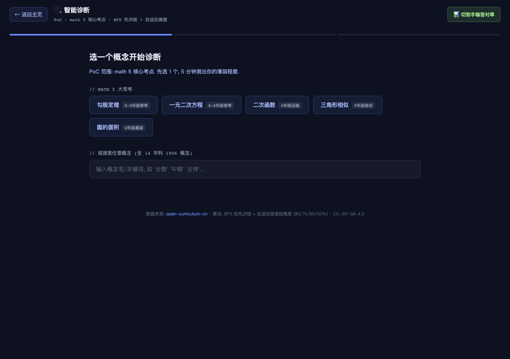
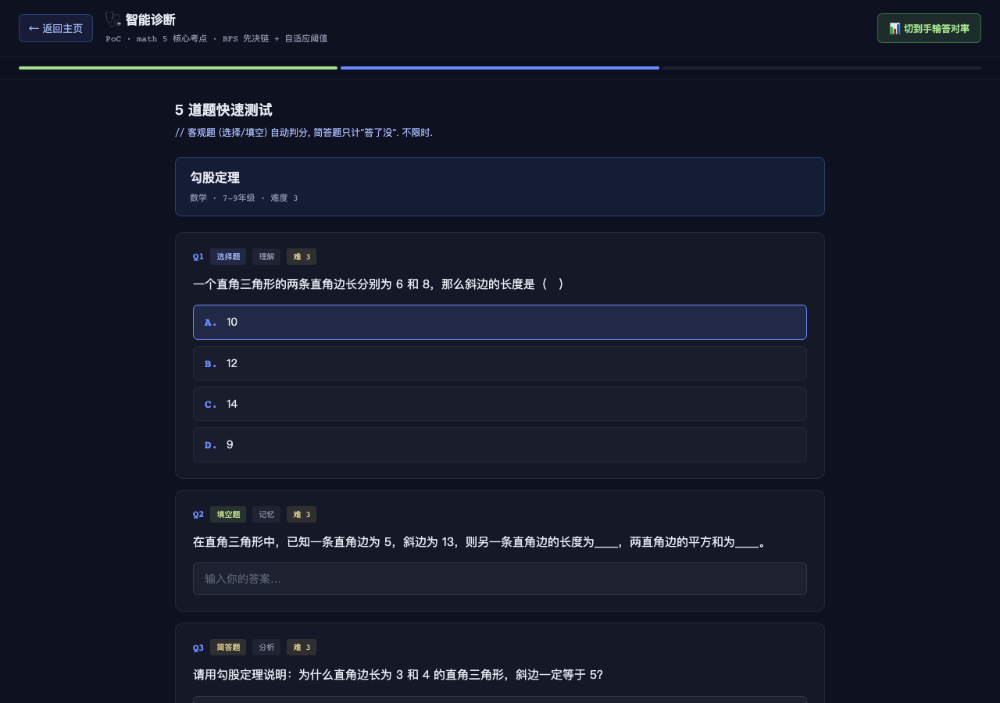
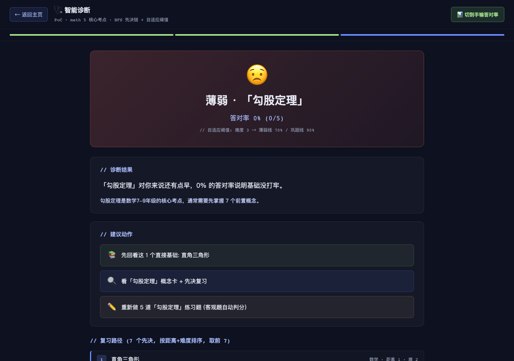
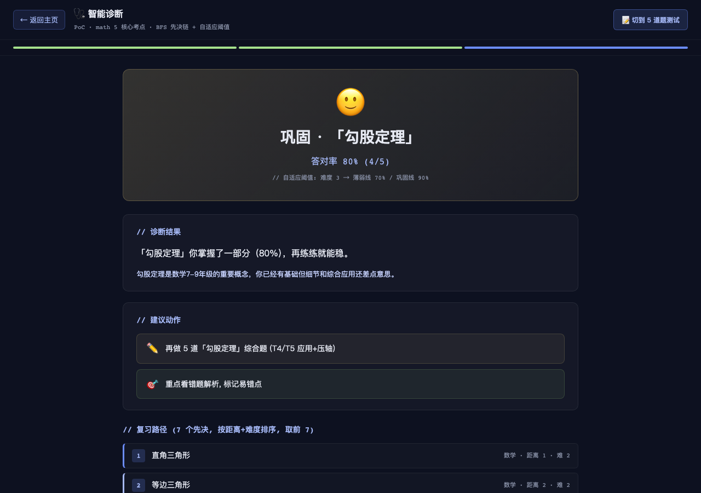
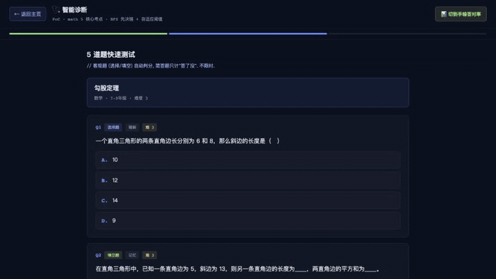

# V4.0.2 Release Notes — 智能诊断 PoC

> **一句话**: 测出你"会不会", 不是看你"想不想学"。

## TL;DR

- **新增**: 智能诊断 PoC (math 5 核心考点)
  - 5 道题快速测试 OR 手输答对率 → 薄弱/巩固/已掌握
  - BFS 找先决链 → 复习路径 (按距离+难度排序)
  - 人话解释 + 3 个 action items
- **新增**: 后端 API 2 个 V4 端点 (`POST /v4/diagnose` + `GET /v4/diagnose/quick-check`)
- **新增**: 概念卡 "🩺 智能诊断" 按钮 (3D 球/漏斗/概念卡全链路)
- **算法**: BFS 找先决链 + 自适应阈值按概念难度 (80/70/60/50%)
- **前端**: 客户端 JS 跑算法, GitHub Pages 静态站可工作 (不依赖后端)
- **范围**: math 1 学科 5 核心考点 (勾股定理/一元二次方程/二次函数/三角形相似/圆的面积)
- **未来**: 推到 V4.0.3-V4.1+ 11 件事 (持久化/全 14 学科/个性化/导出/老师视角等)

## 公网 URL

- **诊断页**: https://zachsaws.github.io/open-curriculum-cn/diagnose.html
- **直接进勾股定理**: https://zachsaws.github.io/open-curriculum-cn/diagnose.html?concept_id=M_G4_GM_08
- **3D 球 + 诊断按钮**: https://zachsaws.github.io/open-curriculum-cn/explore.html
- **漏斗 + 诊断按钮**: https://zachsaws.github.io/open-curriculum-cn/funnel.html

## 设计原则 (天祥 2026-07-29 拍板)

V4.0.2 PoC 范围控制:

### 砍掉 (不在产品定位)
- 班级/学校横向对比 dashboard (个人学习辅助, 不做学校管理系统)
- 教师共建自定义题 (UGC 审核, V4.x 不碰)
- 拍照/语音输入 (公网页面无隐私保障, App 才做)
- 学习目标 (LLM agent 该做的, 不是知识图谱)
- 题目讲解视频 (AI 视频生产公司的活)

### 推后 (PoC 不做, 但有版本计划)
- V4.0.3: 诊断历史持久化/进度跟踪/错题本/手输副入口补全/全 14 学科
- V4.0.4: 报告导出 PDF/自适应难度/7 天复习计划
- V4.0.5+: 个性化推荐
- V4.1+: B 端老师视角/真人 1v1 答疑 (外包)

## 算法 (核心)

### 1. 难度 1-5 → 自适应阈值

| 难度 | 薄弱线 | 巩固线 | 含义 |
|---|---|---|---|
| 1-2 (基础) | 80% | 95% | 简单题答错 1 道就是薄弱 |
| 3 (核心考点) | 70% | 90% | 大部分要会 |
| 4 (拔高) | 60% | 80% | 答对 3/5 已经 OK |
| 5 (压轴) | 50% | 70% | 答对一半算掌握 |

**为什么按难度调阈值?**
基础题答错说明基础没打牢, 压轴题答对一半就算不错 — 同样 60% 答对率, 压轴题的人比基础题的人掌握得好。

### 2. 状态判定
- `score < weak_threshold` → **薄弱** (😟)
- `weak_threshold ≤ score < consolidate_threshold` → **巩固** (🙂)
- `score ≥ consolidate_threshold` → **已掌握** (🎉)

### 3. BFS 找先决链
从目标概念反向 BFS, 找到所有先决概念, 标注 distance (1=直接先决, 2=间接先决, ...).

### 4. 复习路径排序
按 `(distance ASC, difficulty ASC)` 排序 — 距离近 + 难度低的优先 (基础先打牢). 取前 8 个给 UI.

### 5. 人话解释
按 status 给 3 个不同模板:
- **薄弱**: "「X」对你来说还有点早, N% 答对率说明基础没打牢" + "先回看 N 个直接基础" 建议
- **巩固**: "「X」你掌握了一部分 (N%), 再练练就能稳" + "再做 5 道综合题" 建议
- **已掌握**: "「X」你掌握得不错 (N%), 可以放心往后走" + "查看后续概念" 建议

## API 端点 (V4.0.2 新增)

| Method | Path | 说明 |
|---|---|---|
| POST | `/v4/diagnose` | 5 道题测试主入口 (传 `answers: [bool]*5`) |
| GET | `/v4/diagnose/quick-check` | 手输答对率副入口 (传 `?concept_id=&score=`) |

需要 `X-API-Key` header (3 个 demo key: free/pro/enterprise).

### POST /v4/diagnose 示例

```bash
curl -X POST -H "X-API-Key: demo-key-001" -H "Content-Type: application/json" \
  -d '{"concept_id":"M_G4_GM_08","answers":[true,true,true,false,false]}' \
  http://localhost:8001/v4/diagnose
```

返回:
```json
{
  "concept_id": "M_G4_GM_08",
  "concept_title": "勾股定理",
  "subject_cn": "数学",
  "difficulty": 3,
  "grade_range": "7-9年级",
  "score": 0.6,
  "score_pct": 60,
  "status": "薄弱",
  "weak_threshold": 70,
  "consolidate_threshold": 90,
  "weak_concepts_count": 7,
  "weak_concepts": [{"id":"M_G4_GM_07","title":"直角三角形","distance":1,"difficulty":2,...}],
  "recommend_path": [...],
  "human_explanation": {
    "summary": "「勾股定理」对你来说还有点早，60% 的答对率说明基础没打牢。",
    "why": "勾股定理是数学7-9年级的核心考点，通常需要先掌握 7 个前置概念。",
    "actions": [
      {"type":"review","text":"先回看这 N 个直接基础: 直角三角形、等腰三角形"},
      {"type":"concept","text":"看「勾股定理」概念卡 + 先决复习"},
      {"type":"exercise","text":"重新做 5 道「勾股定理」练习题"}
    ],
    "status_emoji": "😟"
  }
}
```

## UI 流程 (3 步)


*Step 1: 选概念. PoC 范围 math 5 核心考点 quick pick + 全 1906 概念搜索.*


*Step 2: 5 道题快速测试. 选择/填空自动判分, 简答题只计"答了没".*


*Step 3: 诊断结果 (60% = 薄弱). BFS 找 7 个先决 + 复习路径 + 3 个 action items.*


*Step 3: 诊断结果 (80% = 巩固). 黄色 banner + 2 个 action items.*

## 关键工程决策

1. **前后端算法同步**: `api/diagnose.py` (Python) 和 `web/diagnose.js` (JS) 保持算法一致, 避免 doc/API drift. 前端用客户端版本, 不依赖后端 → GitHub Pages 静态站可工作.

2. **API 后端**: 仍跑 uvicorn (PoC 本地), 未来 V4.0.5+ B 端 SaaS 时部署 Render/Fly.io. 现在前端不调用它.

3. **判分规则**:
   - 选择题: 用户选 letter = 正确答案 letter → 对
   - 填空题: 模糊匹配 (包含/被包含, 去标点)
   - 简答题: 只计"答了没" (字 > 5 算答了, 不判内容)

4. **真真题策略延续**: 诊断的 5 道题默认用 LLM 生成的 5 道, 不混入真真题 — 真真题保留在 "挑战 5 道真题" action 里.

## 公网 URL (同 V4.0.1)

- GitHub Pages: https://zachsaws.github.io/open-curriculum-cn/
- GitHub repo: https://github.com/zachsaws/open-curriculum-cn
- API OpenAPI 文档: `/docs` (uvicorn 跑时)

## 🎬 5 秒演示 GIF



*6s 演示: 选勾股 → 答 5 题 → 80% 巩固 → 复习路径 7 个先决 (按距离+难度排序)*

- 直接 GIF: https://zachsaws.github.io/open-curriculum-cn/data/diagnose_demo.gif
- MP4 版: https://zachsaws.github.io/open-curriculum-cn/data/diagnose_demo.mp4

## 文件清单

- `api/diagnose.py` (新, 8.5KB) - 核心算法 (Python)
- `api/server.py` (改, +92 行) - 加 POST /v4/diagnose + GET /v4/diagnose/quick-check + 修 2 个 root() 冲突
- `web/diagnose.html` (新, 14KB) - 3 步 UI
- `web/diagnose.js` (新, 21KB) - 客户端算法 + 渲染
- `web/explore.html` (改) - 加 "🩺 智能诊断" 按钮
- `web/funnel.html` (改) - 同上
- `web/3d.js` (改, +2 行) - 设按钮 href
- `web/funnel.js` (改, +2 行) - 同上
- `web/diagnose.html` (改) - 顶栏加 "🎬 看 5 秒演示" 按钮
- `web/data/diagnose_demo.gif` (新, 693KB) - 6s 演示 GIF
- `web/data/diagnose_demo.mp4` (新, 108KB) - 6s 演示 MP4

## 验收清单

- [x] math 5 核心考点 quick pick (勾股/一元二次/二次函数/相似/圆)
- [x] 全 1906 概念搜索入口
- [x] 5 道题测试 (主入口) — 选/填/简答题自动渲染
- [x] 手输答对率 slider (副入口) — PoC 决定做 (30min 工作量, 入口更完整)
- [x] 自适应阈值按难度 (5 档) — 80/70/60/50% 算法
- [x] BFS 找先决链 — 7 个直接先决对勾股定理
- [x] 复习路径排序 (距离+难度) — 直角三角形 (距 1 难 2) → 等边 (距 2 难 2) → ...
- [x] 人话解释 (summary/why/actions) — 3 个 status 模板
- [x] 概念卡按钮 (4 处: explore/funnel/3d.js/funnel.js)
- [x] API 2 个 V4 端点 (diagnose + quick-check)
- [x] 鉴权 (3 demo key)
- [x] /docs 自动 OpenAPI
- [x] 截图 4 张 (step1/step2/step3-weak/step3-consolidate)
- [x] 6s 演示 GIF + MP4 (社交传播 + 长视频平台)

## 后续 (V4.0.3+)

按 V4.0 中期 6 个月方向:
- V4.0.3 (3 个月): 诊断历史持久化 (localStorage) + 全 14 学科 + 错题本 + 进度趋势
- V4.0.4 (4-5 个月): 报告导出 PDF + 自适应难度 (IRT) + 7 天复习计划
- V4.0.5 (6 个月): 个性化推荐 (薄弱 → 视频/教材对接)
- V4.1+ (12 个月): B 端老师视角 dashboard + 海外华人 K12 + 高校先修课图谱
