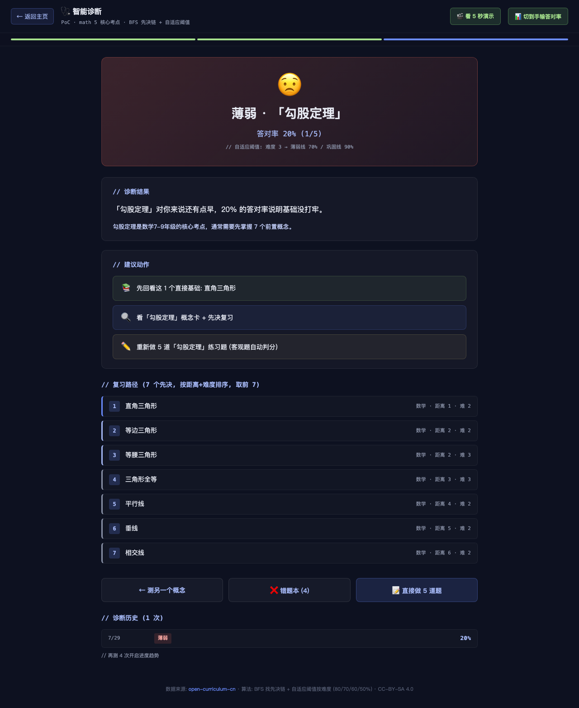
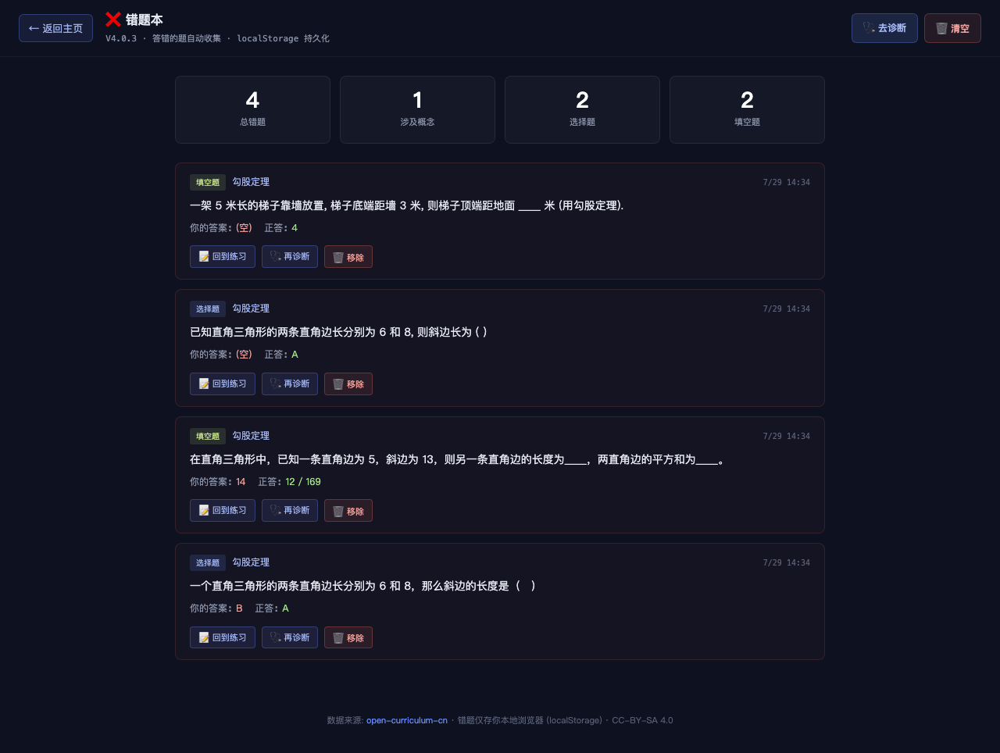

# V4.0.3 Release Notes — 诊断历史 + 错题本 + 全 14 学科

> **一句话**: 测一次不丢, 答错自动收, 不再是 PoC 一次性的"看看你会不会"

## TL;DR

V4.0.2 是"测一次", V4.0.3 让它变成"持续用":
- 诊断历史持久化 (localStorage) — 不再丢
- 答错题自动收错题本 — 不用手抄
- 全 14 学科扩量 — 不只是 math
- 进度趋势图推到 V4.0.4 (避免内嵌字符串 syntax 坑)

## 公网 URL

- 诊断: https://zachsaws.github.io/open-curriculum-cn/diagnose.html
- 错题本: https://zachsaws.github.io/open-curriculum-cn/wrongbook.html
- 直入勾股: https://zachsaws.github.io/open-curriculum-cn/diagnose.html?concept_id=M_G4_GM_08

## 新增功能 (3 件)

### 1. 诊断历史 + 错题本持久化 (web/history.js)

**2 个独立 localStorage store**:

| Store | Key | 容量 | 用途 |
|---|---|---|---|
| 诊断历史 | `opencurriculum:diagnose_history` | 500 条 | 每次诊断 (test/quick-check) 记录, 列出最近 5 次 |
| 错题本 | `opencurriculum:wrongbook` | 1000 条 | 答错客观题自动收, 列出+重做+移除 |

**API 暴露** (`window.HistoryStore`):
```js
HistoryStore.recordDiagnosis({concept_id, score, status, ...})  // 提交时自动调
HistoryStore.recordWrong({exercise_id, question, user_answer, correct_answer, ...})  // 答错时自动调
HistoryStore.getWrongbook()  // 列出所有错题
HistoryStore.getConceptHistory(concept_id)  // 某概念历史
HistoryStore.removeFromWrongbook(exercise_id)  // 移除单条
HistoryStore.clearWrongbook()  // 清空
HistoryStore.getWrongbookStats()  // {total, by_concept, by_type}
```

**去重**: 错题本同 exercise_id 不重复入库 (重做错题不会重复入).

### 2. 错题本页面 (web/wrongbook.html, 8.8KB)

**布局**:
- 顶栏: ← 返回 / ❌ 错题本 / 去诊断 + 🗑 清空
- 4 个统计卡: 总错题 / 涉及概念 / 选择题 / 填空题
- 错题卡 (按时间倒序):
  - 题型标签 (选择题/填空题/简答题) + 概念名 + 时间戳
  - 题目
  - 你的答案: X (红) / 正答: Y (绿)
  - 3 个操作: 回到练习 / 再诊断 / 移除

**空态**: 错题本是空的 (有"去测一次"CTA)

### 3. 全 14 学科 quick pick

之前 5 个全 math 核心, 现在 **19 个全学科核心**:
- math 6 (分式 + V4.0.2 PoC 5 考点)
- chinese / english / physics / chemistry / biology / history / geography / morality_law / science / info_tech / art / pe_health / labor 各 1 个 highest-centrality 节点

排序按 `centrality` 字段 (V3.6.6 算过), 自动选每个学科"最核心"概念.

### 4. 诊断结果页加历史区

```
// 诊断历史 (1 次)
7/29  薄弱  20%
// 再测 4 次开启进度趋势
```

满 5 次后:
```
// 诊断历史 (5 次)
...
// 已测 5 次 · 完整进度趋势图见 V4.0.4
```

5+ 次时 (V4.0.4) 画 canvas 时序图.

## Bug 修复 (2 个)

1. **`ex.options` 破损/null 时 `JSON.parse()` 抛错** — 之前诊断结果页不渲染. 修: 适配 string/array/null, try-catch fallback [].
2. **`fill_blank` 的 `answer` 是 list `['12', '169']` 时 `.replace()` 抛错** — 修: 转字符串 `toStr` 适配 list, `Array.some()` 任一候选命中就算对.

## 设计: 砍掉/推后 (V4.0.2 → V4.0.3)

**砍掉** (不在产品定位):
- 班级对比 dashboard / 教师 UGC / 拍照语音 / 学习目标 / 视频讲解

**推后到 V4.0.4**:
- 完整 canvas 进度趋势图 (5+ 次自动激活)
- PDF 报告导出
- IRT 自适应难度

## UI 流程 (1 步扩展)

V4.0.2 流程: 选概念 → 答 5 题 → 结果页 (3 步)

V4.0.3 流程: 选概念 (19 个 quick pick) → 答 5 题 → 结果页 (3 步) + 历史区 (新) + 错题本按钮 (新)



*薄弱 · 勾股定理 20% (1/5) · 复习路径 7 个先决 · 错题本 (4) 按钮 · 诊断历史 (1 次)*



*4 道错题 + 4 统计卡 + 你的答案 vs 正答对比*

## 验收清单

- [x] history.js 2 store (500/1000 容量限制)
- [x] 答错题自动收 (去重同 ex_id)
- [x] 诊断历史自动记录 (test/quick-check 两条入口都覆盖)
- [x] 错题本列表 + 重做/移除/清空
- [x] 全 14 学科 quick pick (19 节点)
- [x] 诊断结果页加历史区 + 错题本按钮
- [x] JSON.parse 适配 list/null 修复
- [x] fill_blank answer list 修复
- [x] 主页加 2 个入口 (🩺 + ❌)
- [x] 公网 200, 端到端测试通过 (4 道错题正确入库)
- [x] commit 5cf960f, push, GitHub Pages 部署

## 公网 URL (同 V4.0.2)

- 主页: https://zachsaws.github.io/open-curriculum-cn/
- GitHub repo: https://github.com/zachsaws/open-curriculum-cn
- GitHub Release v4.0.3: https://github.com/zachsaws/open-curriculum-cn/releases/tag/v4.0.3

## 文件清单

- `web/history.js` (新, 3.5KB) — 2 store
- `web/wrongbook.html` (新, 8.8KB) — 错题本页
- `web/diagnose.js` (改, +60 行) — 集成 history + 全 14 学科
- `web/diagnose.html` (改) — 加 history.js script + CSS
- `web/index.html` (改) — 主页加 2 入口

## 后续 (V4.0.4+)

| 版本 | 内容 | 工程量 |
|---|---|---|
| V4.0.4 (3-4 月) | 完整 canvas 进度趋势图 + PDF 报告导出 + IRT 自适应难度 + 7 天复习计划 | 1 个月 |
| V4.0.5 (5-6 月) | 个性化推荐 (薄弱 → 视频/教材对接) | 1 个月 |
| V4.1+ (12 月) | B 端老师视角 dashboard + 海外华人 K12 + 高校先修课图谱 | 6-12 月 |
