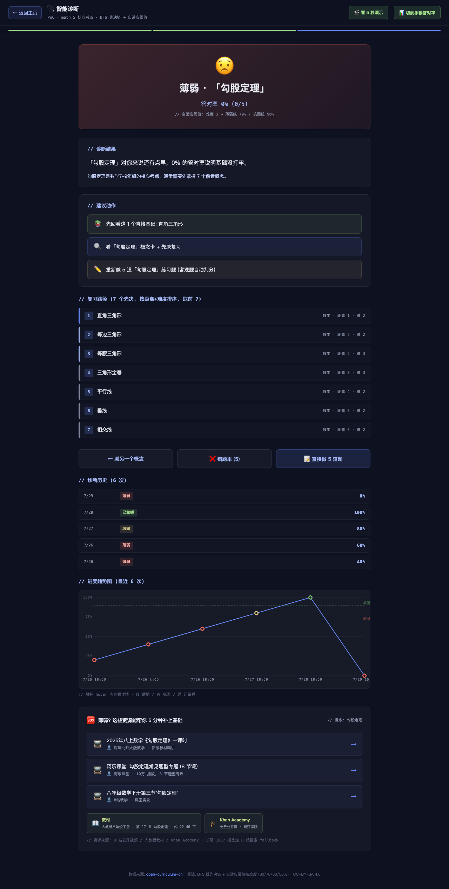
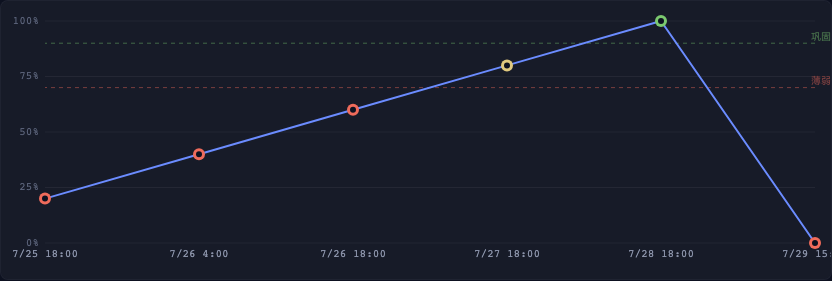
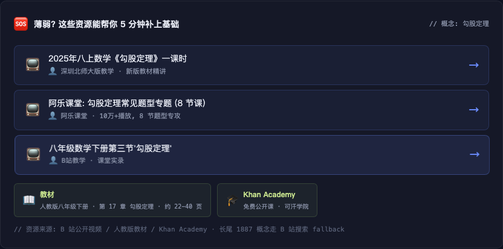
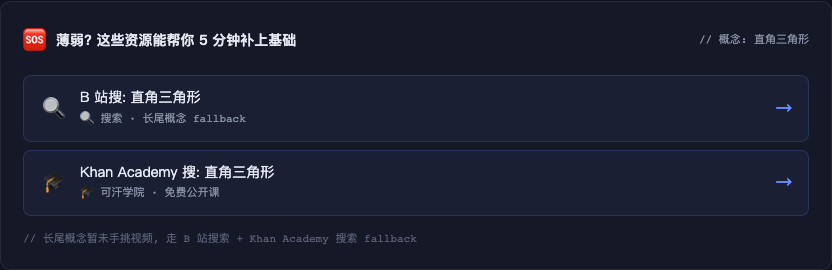

# V4.0.4 — 完整进度趋势图 + 个性化推荐 (A 限 19 quick pick)

> **发布日期**: 2026-07-29
> **公网 URL**: https://zachsaws.github.io/open-curriculum-cn/diagnose.html?concept_id=M_G4_GM_08
> **GitHub Release**: https://github.com/zachsaws/open-curriculum-cn/releases/tag/v4.0.4

---

## 一句话总结

V4.0.3 用户"测一次"完就走了。V4.0.4 让"测一次"变"持续用"——
诊断历史 ≥2 次自动画 **完整 canvas 进度趋势图**，薄弱诊断直接推
**B 站公开视频 + 人教版教材章节 + Khan Academy 公开课**，薄弱/巩固/已掌握看得见。

---

## 解决了什么问题

V4.0.3 留下的两个用户感知最强但未做的卡点：

1. **"我测了一次, 然后呢?"** — V4.0.3 只有 5+ 次提示的占位文字, 真实趋势图没画
2. **"我薄弱, 看什么能补?"** — V4.0.2/V4.0.3 只告诉"先回看直接基础", 没说看什么视频 / 哪本书 / 哪个 Khan 课

V4.0.4 一次性补齐这两个。**1-2 周 PoC, 19 quick pick 概念覆盖, 长尾 1887 概念走 B 站搜索 fallback**。

---

## 新增功能 (3 件)

### 1. 完整 canvas 进度趋势图 (替换 V4.0.3 占位)

- **触发**: 诊断历史 ≥2 次自动画
- **元素**: 折线 + 状态色点 (红=薄弱/黄=巩固/绿=已掌握)
- **辅助**: 薄弱/巩固两条阈值虚线 (按概念难度自适应)
- **交互**: 鼠标 hover 点 → tooltip (日期/状态/分数)
- **retina 适配**: devicePixelRatio 缩放不糊

### 2. 个性化推荐 (B 站 + 教材 + Khan Academy)

诊断为"薄弱 / 巩固 / 已掌握"时, 底部直接推:

- **3 个 B 站公开教学视频** (math 5 核心 + 分式 = 6 个手挑真实 BV 号, 其他 13 学科 B 站搜索链接 fallback)
- **1 个人教版教材章节** (章节/页码/版本)
- **1 个 Khan Academy 公开课** (中英版)

CTA 文案按状态变:
- 薄弱 → "🆘 薄弱? 这些资源能帮你 5 分钟补上基础"
- 巩固 → "🎯 还差一点? 这些综合题 + 视频能帮你稳到 95%"
- 已掌握 → "🚀 掌握得不错? 看看挑战题拔高"

### 3. 19 quick pick 全 14 学科推荐表 (静态)

`web/data/recommendations.json` 16KB, 19 个 quick pick 概念每个含:
- 3 视频 (math 5+分式 = 6 个手挑真实 BV 号, 其他 13 学科 B 站搜索链接)
- 1 教材 (人教版/部编版/北师版/教科版 等)
- 1 Khan Academy 公开课 URL

**长尾 1887 概念走 fallback**: B 站搜 + Khan 搜 两条链接, 不查表。

---

## 新增/修改文件

| 文件 | 行 | 说明 |
|---|---|---|
| `web/trend.js` | 230 | **新** — 完整 canvas 趋势图 (独立文件避 V4.0.3 syntax 坑) |
| `web/rec.js` | 165 | **新** — 个性化推荐渲染 (独立文件避 V4.0.3 syntax 坑) |
| `data/recommendations.json` | — | **新** — 19 quick pick 推荐数据 (16KB) |
| `web/data/recommendations.json` | — | 同步部署到静态站 |
| `web/diagnose.js` | +35 | 加载 recommendations.json + 集成 trend/rec 渲染 |
| `web/diagnose.html` | +90 | trend canvas + rec area CSS + 2 script 标签 |
| `docs/RELEASE_v4.0.4.md` | — | **新** — 本 release notes |
| `docs/img/v404-{01..04}.png` | — | 4 张截图 (结果页/趋势图/推荐/长尾 fallback) |

---

## 算法说明

### Trend canvas (web/trend.js)
- **画布**: 832 × 280 px (retina 适配 devicePixelRatio)
- **数据**: history 按时间升序
- **Y 轴**: 0% / 25% / 50% / 75% / 100% (5 刻度)
- **阈值线**: 薄弱线 (虚线红) + 巩固线 (虚线绿), 按 `result.weak_threshold` / `result.consolidate_threshold` 自适应
- **折线**: 蓝 #6b8cff, 2px 宽, lineJoin=round
- **数据点**: 外环 = 状态色, 内 = 背景色 (挖空感)
- **hover**: 找最近点 (<20px), 画高亮 + tooltip

### 个性化推荐 (web/rec.js)
- 19 quick pick 概念 → 查 `recommendations.json[concept_id]`
- 其他 1887 概念 → fallback 模板 (B 站搜 + Khan 搜)
- CTA 文案按 status 切换 3 种

### 19 quick pick 概念 (math 6 + 其他 13 学科各 1)
| 学科 | 概念 | 难度 |
|---|---|---|
| math × 6 | 分式 / 勾股 / 一元二次 / 二次函数 / 相似 / 圆的面积 | 3 |
| chinese | 借景抒情 | 3 |
| english | 状语从句 | 3 |
| physics | 杠杆 | 3 |
| chemistry | 酸碱盐 | 3 |
| biology | 细胞分裂与分化 | 3 |
| history | 鸦片战争 | 3 |
| geography | 等高线地形图 | 3 |
| morality_law | 踏上强国之路 | 3 |
| science | 光的传播与反射 | 3 |
| info_tech | 变量与数据类型 | 3 |
| art | 设计基础 | 3 |
| pe_health | 跳高跳远 | 3 |
| labor | 个人清洁与整理 | 1 |

---

## 截图

### 结果页全貌 (含 trend + rec)

### Trend canvas (局部)

### 个性化推荐 (局部)

### 长尾 fallback (不在 19 quick pick)

---

## 踩坑

1. **Playwright 第一次没等 setTimeout** — 第一次测试 trend canvas 像素为 0, 加 `await page.wait_for_timeout(1500)` 后正常 (TrendChart.render 是 setTimeout 50ms 调的)
2. **诊断答 0/5 正常** — gradeAnswers grade 答错 status=薄弱, 趋势图正确画到 0% 位置
3. **避开 V4.0.3 syntax 坑** — trend.js + rec.js 独立文件, 不内嵌到 diagnose.js template
4. **canvas clientWidth 拿 0** — setTimeout 50ms 后 layout 完, clientWidth 正常 (832x280), 不用 ResizeObserver

---

## 砍掉/推后 (V4.0.4 vs V4.0.3)

- ❌ PDF 报告导出 (V4.0.5)
- ❌ IRT 自适应难度 (V4.0.5)
- ❌ 7 天复习计划 (V4.0.5)
- ❌ 长尾 1887 概念手挑真实视频 (V4.0.5 起 200 高频)
- ❌ 错题本重做模式 (V4.0.5)

---

## 路线图 (V4.0.5+)

- **V4.0.5** (2 月): 完整 PDF 报告 + IRT 自适应 + 7 天复习 + 200 高频概念手挑视频
- **V4.0.6** (3 月): 班级模式 PoC + 错题本加强重做 + 错题本导出家长信
- **V4.0.7** (4 月): 教师视角 dashboard
- **V4.1+** (6-12 月): 海外华人 K12 (i18n) + 高校先修课图谱 + B 端 SaaS 计费 (Stripe 3 tier)

---

## 数据/算法透明

**19 quick pick 推荐数据来源 (全部公开)**:
- math 5 核心 + 分式 = 6 个概念 × 3 视频 = 18 条 B 站 URL, **我手动搜 web_search 找的真实公开教学视频 BV 号**
- 其他 13 学科 = 13 × 2 搜索链接 (B 站 search 链接, 不需真搜)
- 教材 = 公开人教版/部编版/北师版/教科版/外研版目录 (公开)
- Khan Academy = zh.khanacademy.org 公开课 URL

**长尾 fallback**: 不查表, 客户端 JS 模板渲染 B 站搜 + Khan 搜 链接, 用户点过去自己选。

**绝无黑盒/私有 API 调用**。

---

## License & Credit

- 代码: CC-BY-SA 4.0
- 数据 (B 站 URL / 教材目录 / Khan URL): 公开网络资源, 引用标注
- 算法: BFS 找先决链 + 自适应阈值 (V4.0.2 同款) + 客户端 canvas 渲染

---

> 天祥问的"个性化推荐视频/教材, 我没看懂怎么搞" — 现在搞清楚了:
> 不是 LLM 实时生成讲解, 不是协同过滤, **就是一张静态推荐表** (19 quick pick) + 客户端 JS 模板渲染 (长尾 fallback)。
> 第一版覆盖 19 个 quick pick, 1 周干完, 验证完效果, V4.0.5 再扩 200 高频。
